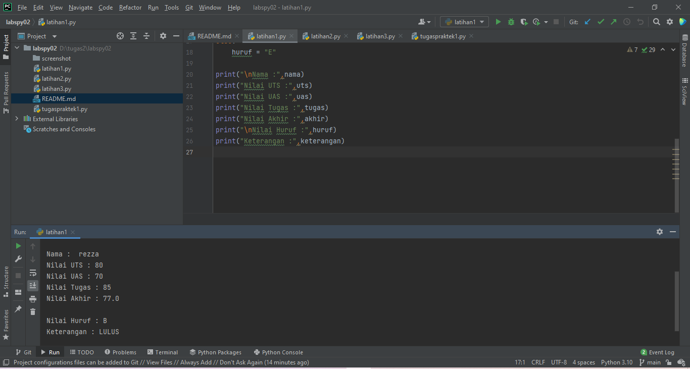
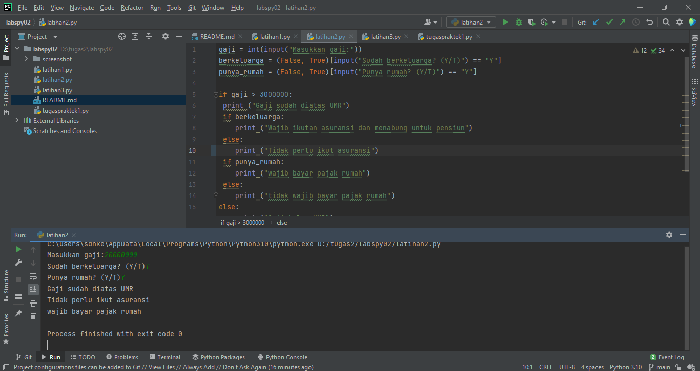
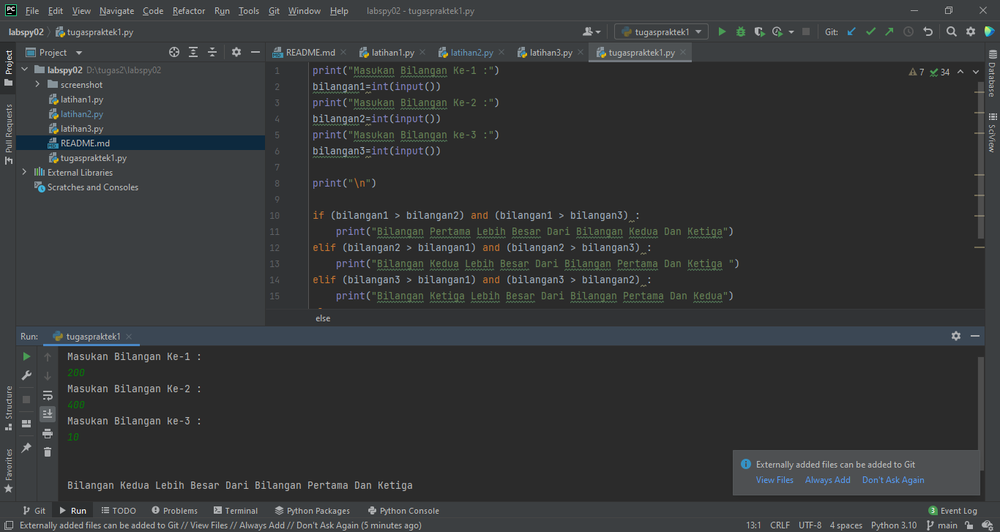
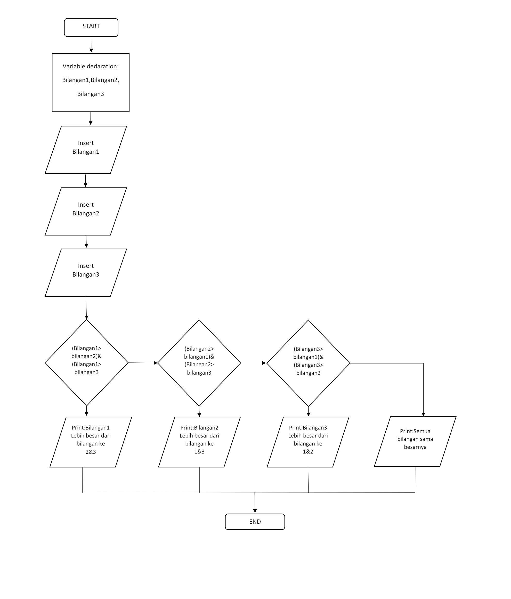

# labspy02
## Praktikum ke 2
### Tugas Program
1.Membuat program menentukan nilai akhir

2.Membuat program menampilkan status gaji karyawan.

3.penggunaan kondisi OR
program membandingkan 3 input bilangan, apabila penjumlahan 2 bilangan hasilnya
sama dengan bilangan lainnya, maka cetak pernyataan “BENAR”

Disini agar hasil output nya benar kalian harus memasukan bilangan sesuai kelipatannya misalkan 10,20,30 jadi kalian harus memasukan kelipatan 10.

4.Buat program sederhana dengan input tiga buah bilangan, dari ketiga bilangan
tersebut tampilkan bilangan terbesarnya. Gunakan statement if.

    
    Berikut untuk Algoritma nya:
    
    print("Masukan Bilangan Ke-1 :")
    bilangan1=int(input())
    print("Masukan Bilangan Ke-2 :")
    bilangan2=int(input())
    print("Masukan Bilangan ke-3 :")
    bilangan3=int(input())

    print("\n")

    if (bilangan1 > bilangan2) and (bilangan1 > bilangan3) :
    print("Bilangan Pertama Lebih Besar Dari Bilangan Kedua Dan Ketiga")
    elif (bilangan2 > bilangan1) and (bilangan2 > bilangan3) :
    print("Bilangan Kedua Lebih Besar Dari Bilangan Pertama Dan Ketiga ")
    elif (bilangan3 > bilangan1) and (bilangan3 > bilangan2) :
    print("Bilangan Ketiga Lebih Besar Dari Bilangan Pertama Dan Kedua")
    else:
    print("Semua Bilangan Sama Besar Nya")
Berikut untuk flowchartnya:

    
    ITU SAJA TERIMAKASIH